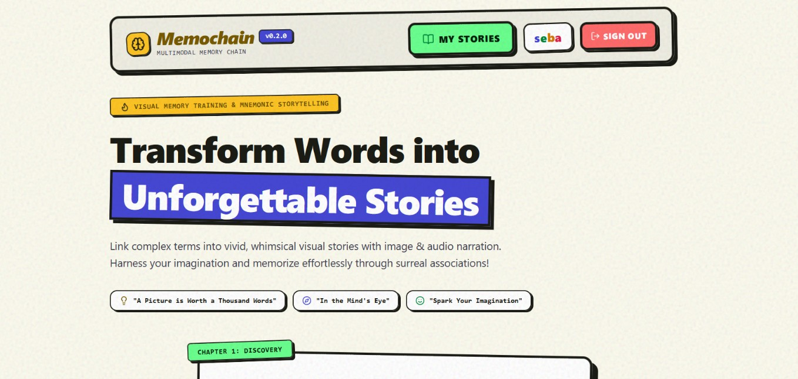
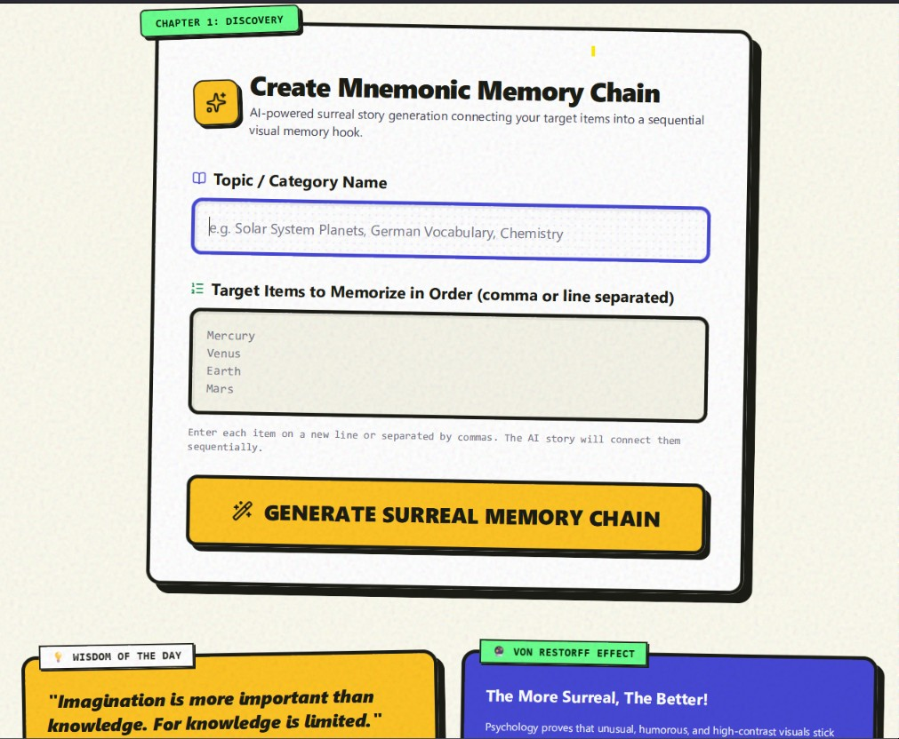
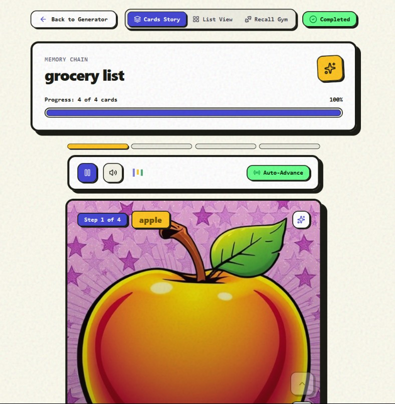
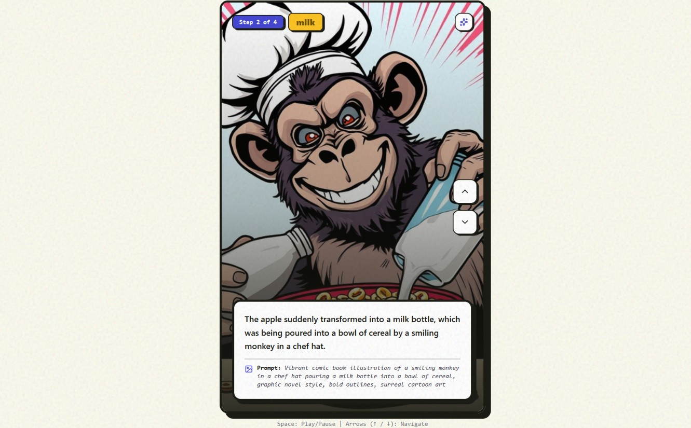
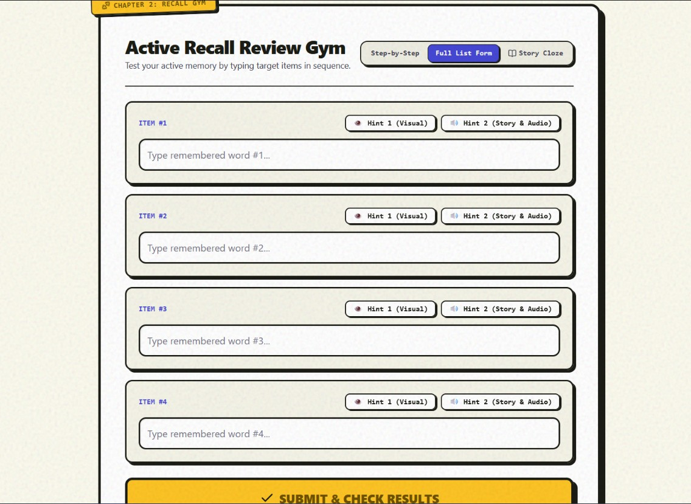
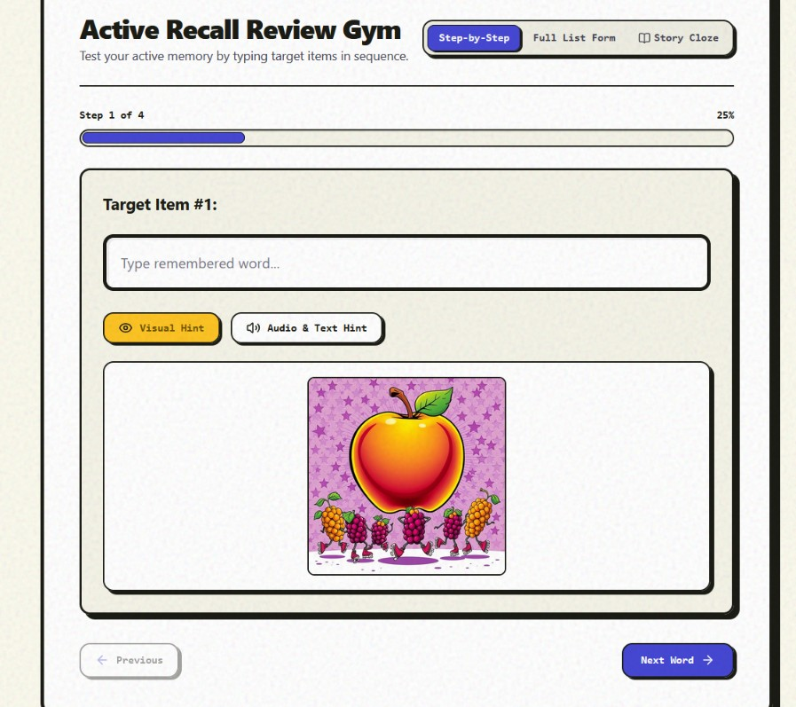
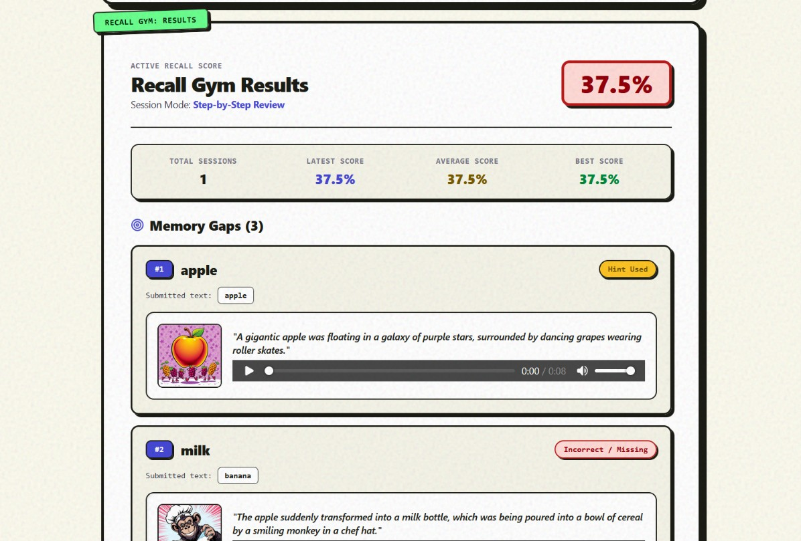
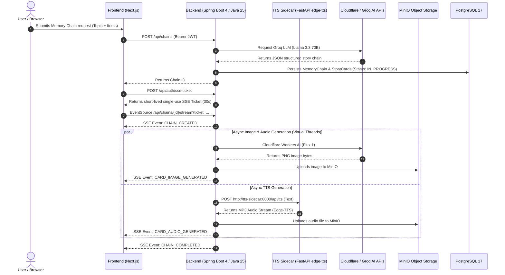

# 🧠 Pamiec (Memory Chain)

> **AI-Powered Multimodal Mnemonic Chain Application for Accelerated Learning**

[](https://openjdk.org/)
[](https://spring.io/projects/spring-boot)
[](https://nextjs.org/)
[](https://www.typescriptlang.org/)
[](https://tailwindcss.com/)
[](https://www.postgresql.org/)
[](https://redis.io/)
[](https://min.io/)

---

## 📌 Overview

**Pamiec** ("Memory") is a modern web application designed to eliminate the tedium and low retention rates of passive rote learning (such as foreign language vocabulary, biological terminology, historical facts, or technical definitions).

Traditional repetition methods (like basic flashcards) lack strong cognitive hooks. The human brain retains information far more effectively when target concepts are woven into a **vivid, absurd, and surreal narrative chain** enhanced by multimodal sensory inputs (text, surreal AI visual art, voice narration) and active recall testing.

The application leverages generative artificial intelligence (LLM + Text-to-Image + Text-to-Speech) to automatically construct interactive mnemonic chains from user-provided learning items.

---

## 📸 Application Screenshots

### 1. Main Landing Page & Dashboard
_Overview of user memory chains, learning statistics, and quick navigation._



---

### 2. Memory Chain Creator
_Interactive form for entering target learning items, vocabulary, or concepts to generate a surreal mnemonic chain._



---

### 3. Multimodal Story Carousel (TikTok / IG Stories Style)
_Swipeable story cards featuring AI-generated surreal illustrations (`Flux.1-schnell`), narrative mnemonic text, and neural voice narration (`edge-tts`)._

| Card 1: Mnemonic Scene | Card 2: Sequential Link |
| :---: | :---: |
|  |  |

---

### 4. Interactive "Recall Gym" & Dynamic Hint Engine
_Active memory testing where users recall items in sequence. Features forgiving fuzzy matching and progressive visual/narrative hints when stuck._

| Active Recall Input | Dynamic Hint Reveal |
| :---: | :---: |
|  |  |

---

### 5. Recall Session Results & Analytics
_Detailed performance summary displaying accuracy percentage, retention breakdown, and identified memory gaps (`MemoryGap`)._



---

## ✨ Core Features

1. **Generative Mnemonic Chain (AI Story Engine)**
   - Utilizes **Groq Cloud LLM (`llama-3.3-70b-versatile`)** to swiftly craft surreal, action-packed narrative links connecting Item A → Item B → Item C.
2. **Surreal AI Illustrations (Cloudflare Workers AI)**
   - Each story card generates a vivid visual illustration using Cloudflare Workers AI (`@cf/black-forest-labs/flux-1-schnell`).
   - Supports background async generation and on-demand image regeneration.
3. **Expressive Voice Narration (Neural TTS Sidecar)**
   - Real-time audio narration powered by a dedicated Python FastAPI sidecar microservice utilizing **Microsoft Edge Neural TTS** (`edge-tts`).
4. **Real-Time Event Streaming (SSE + One-Time Ticket Auth)**
   - Uses **Server-Sent Events (SSE)** via `/api/chains/{id}/stream` – story cards render progressively without waiting for the full media pipeline to finish.
   - **One-Time SSE Ticket**: A secure 2-step token exchange (`POST /api/auth/sse-ticket`) issuing a single-use 30-second ticket to prevent JWT access token leaks in HTTP server logs.
5. **Interactive "Recall Gym"**
   - Sequential active recall testing for target items.
   - **Fuzzy Matching / Typo Tolerance**: Evaluates answers using string similarity algorithms (Levenshtein / Jaro-Winkler) so minor spelling mistakes or non-semantic typos aren't penalised.
   - **Dynamic Hint Engine**: Gradually reveals story artwork and narrative text hints when the user struggles to recall an item.
   - **Memory Gap Tracking (`MemoryGap`)**: Automatically registers forgotten items for targeted review.
6. **Enterprise Security & Authentication**
   - Mandatory user registration and login.
   - **Short-lived JWT Access Tokens** passed via `Authorization: Bearer` HTTP headers.
   - **Long-lived Rotated Refresh Tokens** stored exclusively in secure `HttpOnly` cookies (`SameSite=Strict`, path `/api/auth/refresh`) with hashed database persistence.
   - **Rate Limiting Protection**: Token-bucket algorithm via **Bucket4j + Redis** guarding authentication endpoints against brute-force attacks.
   - **IDOR Protection**: Strict ownership validation across all REST and SSE endpoints.
7. **User Retention Analytics**
   - Comprehensive dashboard tracking total chains, completed recall sessions, average retention accuracy (%), and identified memory gaps.

---

## 🛠️ Technology Stack

### Backend

- **Language & Framework**: Java 25 (Virtual Threads / Project Loom), Spring Boot 4.1.0
- **Security**: Spring Security, JJWT, HttpOnly Rotated Refresh Cookies, Bucket4j + Redis Rate Limiting
- **Database**: PostgreSQL 17 + Flyway Database Migrations
- **Object Storage**: AWS S3 SDK v2 + MinIO (storing WebP/PNG images and MP3 audio)
- **Cache & Rate Limiting**: Redis 7
- **AI Integration**:
  - **LLM**: Groq Cloud API (`llama-3.3-70b-versatile`)
  - **Image Gen**: Cloudflare Workers AI (`@cf/black-forest-labs/flux-1-schnell`)
  - **TTS**: Python FastAPI Sidecar (`edge-tts`)

### Frontend

- **Framework**: Next.js 16 (App Router) + React 19
- **Language**: TypeScript 5
- **Styling**: Tailwind CSS v4
- **Animations & Gestures**: Framer Motion (swipeable gesture carousel)
- **Icons**: Lucide React
- **Testing**: Vitest, React Testing Library, JSDOM

---

## 🏗️ System Architecture



---

## 📁 Repository Structure (Monorepo)

```
pamiec/
├── backend/                        # Spring Boot Application (Java 25)
│   ├── src/main/java/pl/pamiec/backend/
│   │   ├── config/                 # Spring, CORS, Async, S3, Redis Configurations
│   │   ├── domain/
│   │   │   ├── chain/              # Chain Creation, Groq LLM, Cloudflare Flux AI, SSE
│   │   │   ├── recall/             # Recall Gym, Session Evaluation, MemoryGaps
│   │   │   ├── tts/                # Edge-TTS Client
│   │   │   └── user/               # User Entity, Auth, Refresh Token Management
│   │   ├── security/               # JWT Filter, Rate Limiter (Bucket4j), SecurityConfig
│   │   └── storage/                # MinIO / S3 Storage Integration
│   ├── tts-sidecar/                # Python FastAPI Microservice (edge-tts)
│   │   ├── app.py
│   │   └── requirements.txt
│   └── pom.xml
├── frontend/                       # Next.js 16 Application (React 19)
│   ├── src/
│   │   ├── app/                    # Next.js App Router Pages & Layouts
│   │   ├── components/             # UI Components (RecallGym, StoryCardCarousel, ChainStreamView)
│   │   ├── context/                # AuthContext (Global Authentication State)
│   │   └── hooks/                  # Custom Hooks (useMemoryChainStream)
│   └── package.json
├── cosmic_fable/                   # UI Mockups & Visual Templates
├── docs/                           # Architecture Documentation (ADR, Research)
├── docker-compose.yml              # Infrastructure: PostgreSQL 17, MinIO, Redis 7
├── CONTEXT.md                      # Domain Terminology Glossary
└── README.md                       # Project Root Documentation
```

---

## 🚀 Local Quickstart Guide

### Prerequisites

- **Java 25** (with Virtual Threads enabled)
- **Node.js 20+** and **npm**
- **Docker** & **Docker Compose**
- **Python 3.11+** (for the TTS sidecar)

---

### Step 1: Environment Configuration

Copy the example environment file:

```bash
cp .env.example .env
```

Configure your credentials in `.env` (e.g. `GROQ_API_KEY`, `CLOUDFLARE_ACCOUNT_ID`, `CLOUDFLARE_API_TOKEN`).

---

### Step 2: Launch Infrastructure (Docker)

Start PostgreSQL, MinIO Object Storage, and Redis:

```bash
docker-compose up -d
```

_Service Endpoints:_

- **PostgreSQL**: `localhost:5433` (Database: `pamiec`, User: `postgres`, Password: `postgres`)
- **MinIO Console**: `http://localhost:9090` (User: `minioadmin`, Password: `minioadmin`)
- **Redis**: `localhost:6379`

---

### Step 3: Run Python TTS Sidecar Microservice

```bash
cd backend/tts-sidecar
python -m venv venv
source venv/bin/activate  # On Windows: venv\Scripts\activate
pip install -r requirements.txt
uvicorn app:app --host 0.0.0.0 --port 8000
```

---

### Step 4: Run Spring Boot Backend

In a new terminal window:

```bash
cd backend
./mvnw spring-boot:run
```

The API backend will start at `http://localhost:8080`.

---

### Step 5: Run Next.js Frontend

In a new terminal window:

```bash
cd frontend
npm install
npm run dev
```

Open your browser and navigate to: `http://localhost:3000`.

---

## 📡 API Reference

### Authentication (`/api/auth`)

- `POST /api/auth/register` – Register a new user account
- `POST /api/auth/login` – Login and acquire JWT Access Token (sets HttpOnly `refreshToken` cookie)
- `POST /api/auth/refresh` – Refresh short-lived access token
- `POST /api/auth/logout` – Logout and invalidate refresh token
- `POST /api/auth/sse-ticket` – Issue single-use 30s ticket for SSE connection
- `GET /api/auth/me` – Retrieve current authenticated user profile

### Memory Chains (`/api/chains`)

- `GET /api/chains` – List all memory chains owned by current user
- `POST /api/chains` – Create a new memory chain
- `GET /api/chains/{id}` – Get memory chain details
- `GET /api/chains/{id}/stream` – Open SSE stream for real-time card generation (`?ticket=...` required)
- `POST /api/chains/{id}/cards/{cardId}/generate-image` – Trigger image generation/regeneration on demand

### Recall Gym (`/api/chains/{chainId}/recall`)

- `POST /api/chains/{chainId}/recall` – Submit active recall test answers and evaluate retention score
- `GET /api/chains/{chainId}/recall/summary` – Get historical recall summary for a chain

### User Analytics (`/api/users/me`)

- `GET /api/users/me/stats` – Get aggregated user learning statistics

---

## 🧪 Testing

### Backend Unit & Integration Tests (Spring Boot & JUnit 5)

```bash
cd backend
./mvnw test
```

### Frontend Tests (Vitest & React Testing Library)

```bash
cd frontend
npm run test
```

---

## 📝 License

Developed for educational and demonstration purposes. All rights reserved.
